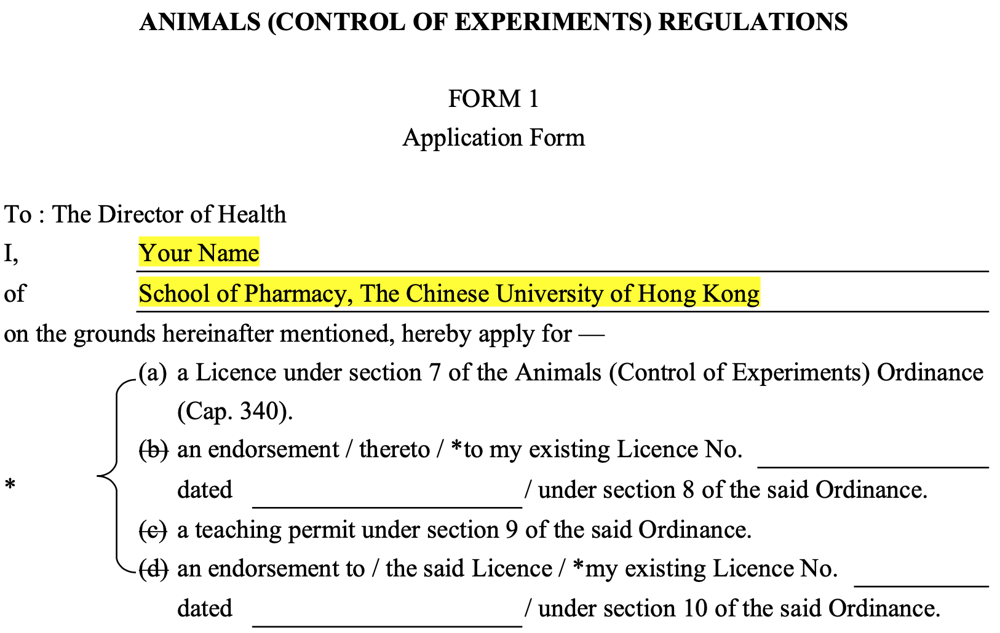
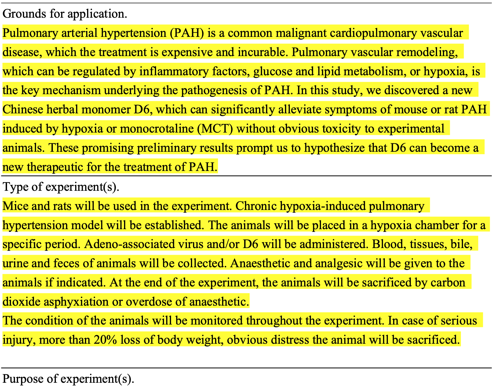
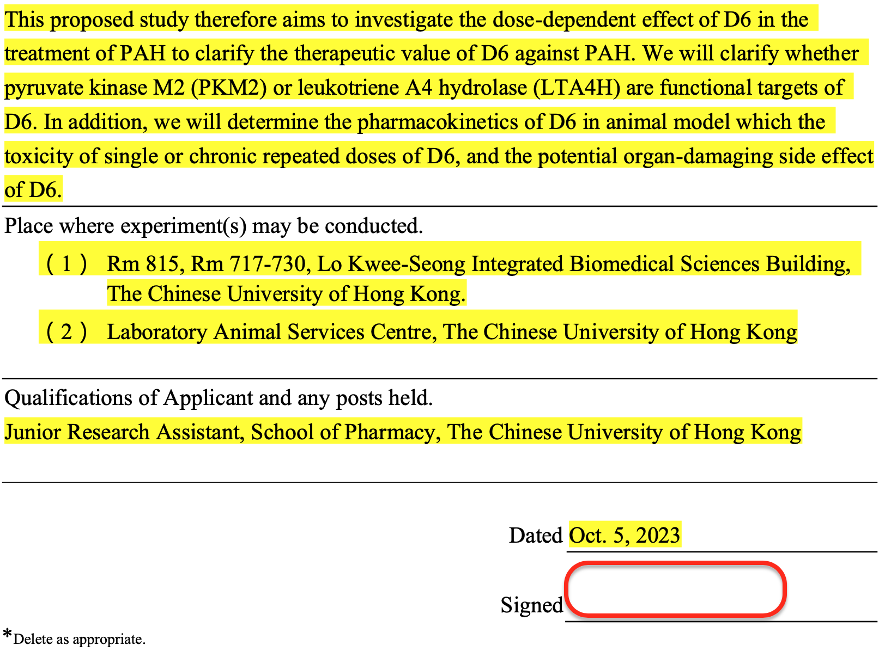
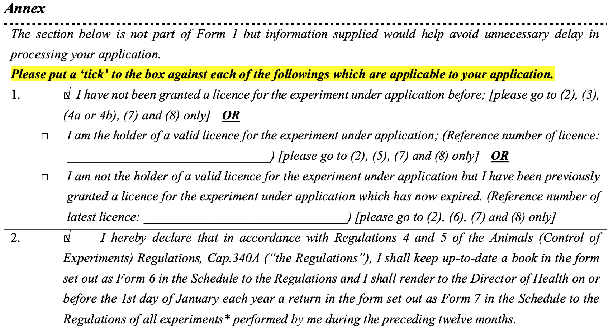
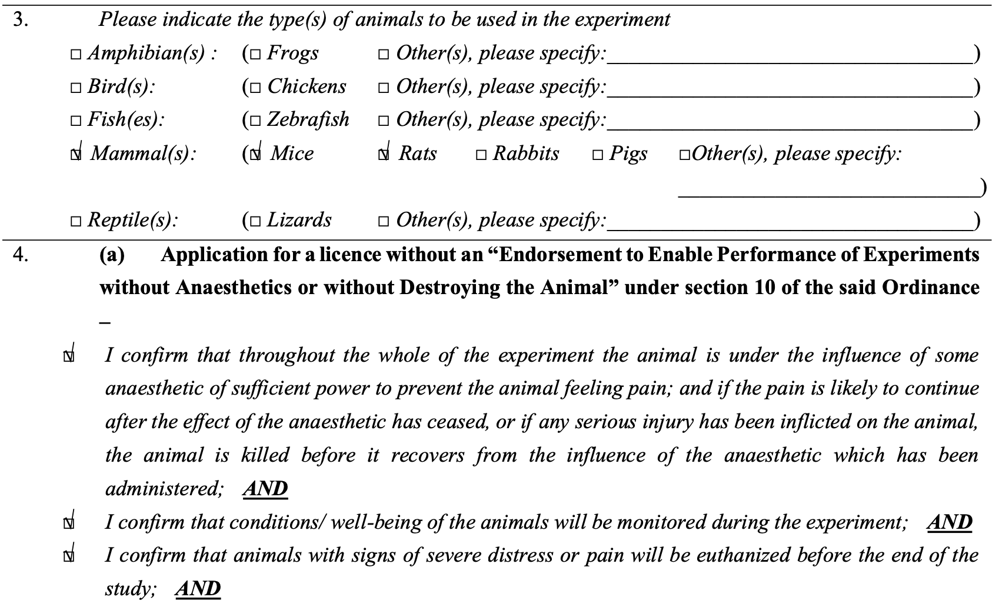
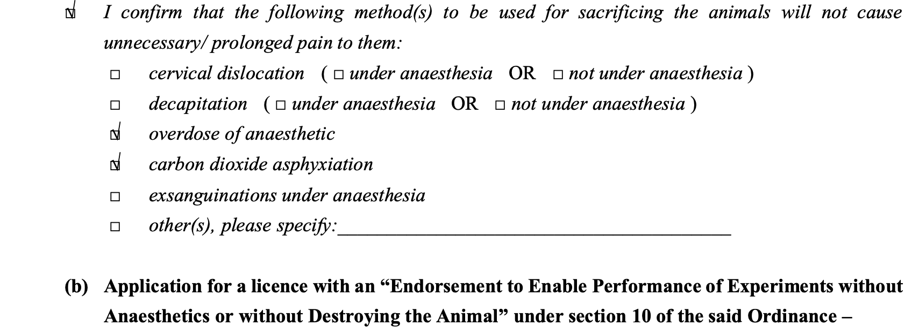
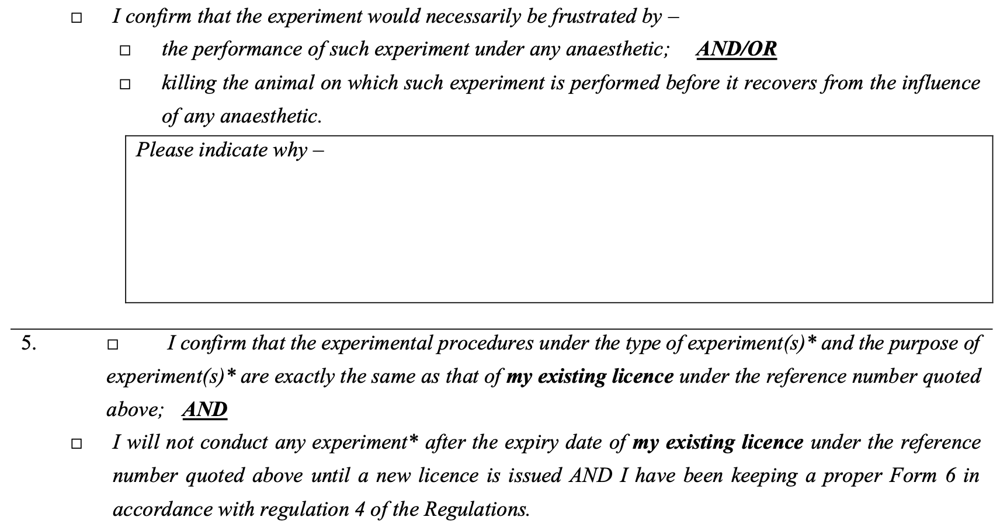
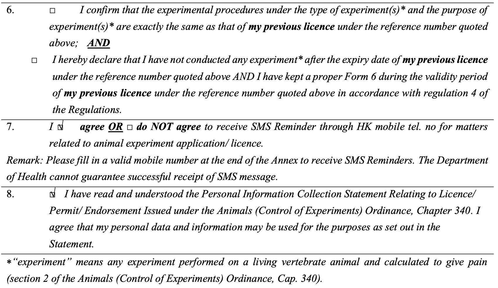
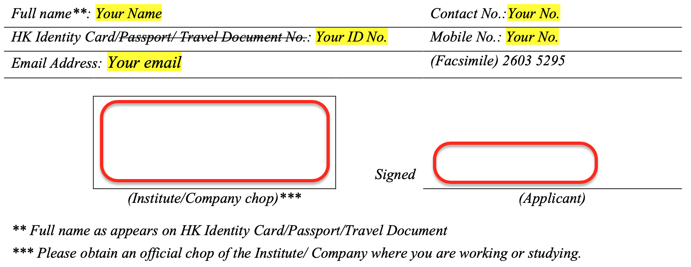

# **Application for Animal license (Off-line)**

### **Step 1 Fill in the Form 1 and Annex to Form 1:**

Download the latest application form (Form 1) from [DOH's website](https://www.dh.gov.hk/english/useful/useful_forms/useful_forms_ani.html)

An example is showed as follows and please adjust the content **marked in yellow** according to your needs

### **Step 2 Print and Sign:**

Print the completed form and sign or stamp at the blank space **circled in red**

### **Step 3 Scan and Submit:**

Submit the completed application form ([Form 1](https://www.dh.gov.hk/english/useful/useful_forms/useful_forms_ani.html)) and Annex to Form 1 to the Director of Health online, by email or post:

| Address: | Health Technology and Advisory Division Department of Health 21/F, Wu Chung House 213 Queen's Road East, Wan Chai, Hong Kong |
| -------- | ------------------------------------------------------------ |
| E-mail:  | [ro_al@dh.gov.hk](mailto:ro_al@dh.gov.hk)                    |
