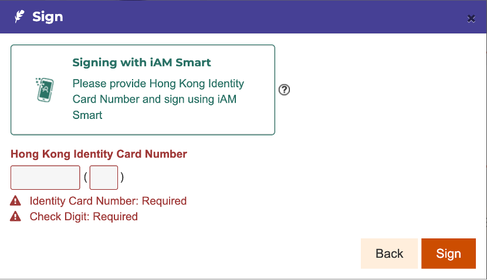

# **Application for Animal license (On-line)**

Prepare APP iAM(智方便) and iAM Smart(智方便+) in advance

<https://www.iamsmart.gov.hk/tc/nhp.html>

### **Step 1 Introduction:**

Click the link:

<https://eform.cefs.gov.hk/form/dh0034/en/>

Start filling in a form by either **1) Start Filling in a New Form** or **2) Fill in a Saved Form**

### **Step 2 Application:**

Fill in all the required information.

For example:

### **Step 3 Annex:**

Fill in your personal information by either **1) use Form filling with iAM Smart e-ME** or **2) type in**

Tick **Annex selection 1 to 7** according to your personal needs

**1) use Form filling with iAM Smart e-ME**

Click the button

Use APP iAM (智方便) to scan the QR code

**2) type in**

### **Step 4 Digital Signature:**

After making sure that the information is all correct, put a digital signature by **signing with iAM Smart**

### **Step 5 Review & Confirm:**

Check the following information before submission and submit

### **Step 6 Acknowledgement:**

