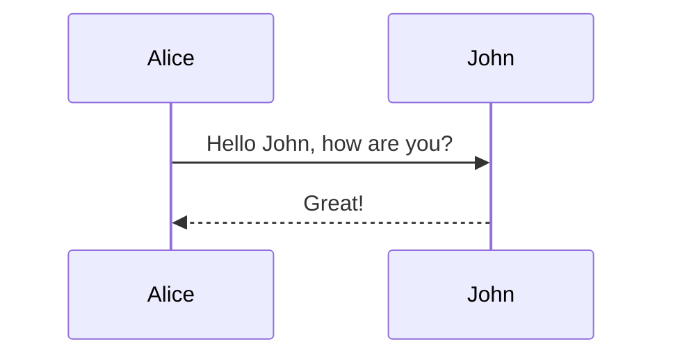
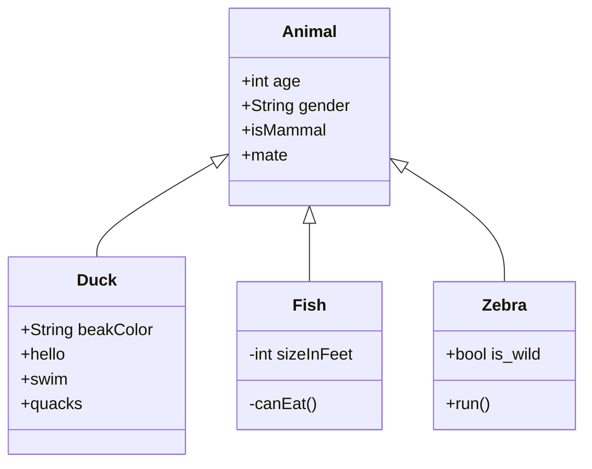

```apl
print "hello";
my $aa={};
```

```perl
#!/usr/bin/perl
BEGIN { $rel_path = "../.." }
do "$rel_path/config/common.pl";
use lib "$rel_path/lib/";
use XD::MySQL;
use XD::Web;
use XD::Base;
use Encode;
use Digest::MD5 qw(md5_hex);
use Redis::Client;
use Data::Dumper;
use Log::Log4perl;
Log::Log4perl->init("log4perl_downloader.conf");
$logger = Log::Log4perl->get_logger();

###############################################################################################################
#
#   dp2.down_pool2 中 status = 2 的链接重新压到 redis.download_list_2
#
###############################################################################################################
$db_auth_gd->{'host'} = '192.168.100.252';
my ($dbh) = open_db( $db_auth_gd, { dbname => 'dp2' } );

# 优先下载链接插入 download_list_u2 的右边: priority>0
$query = "SELECT curPage FROM download_pool2 WHERE project_name='cintcm_zyfj'";
$json_ref = db_query( $dbh, $query );

my $ids = {};

for ( my $i = 1 ; $i <= 84508 ; $i++ ) {
    $ids->{$i} = 1;
}

my $i = 0;
foreach ( @{$json_ref} ) {
    my $curPage = $_->{'curPage'};
    if ( $ids->{$curPage} ) {
        delete $ids->{$curPage};
    }
    $i++;
}
print "$i items\n";

foreach ( keys %$ids ) {
    print "$_\n";
}

close_db($dbh);

exit;

```

