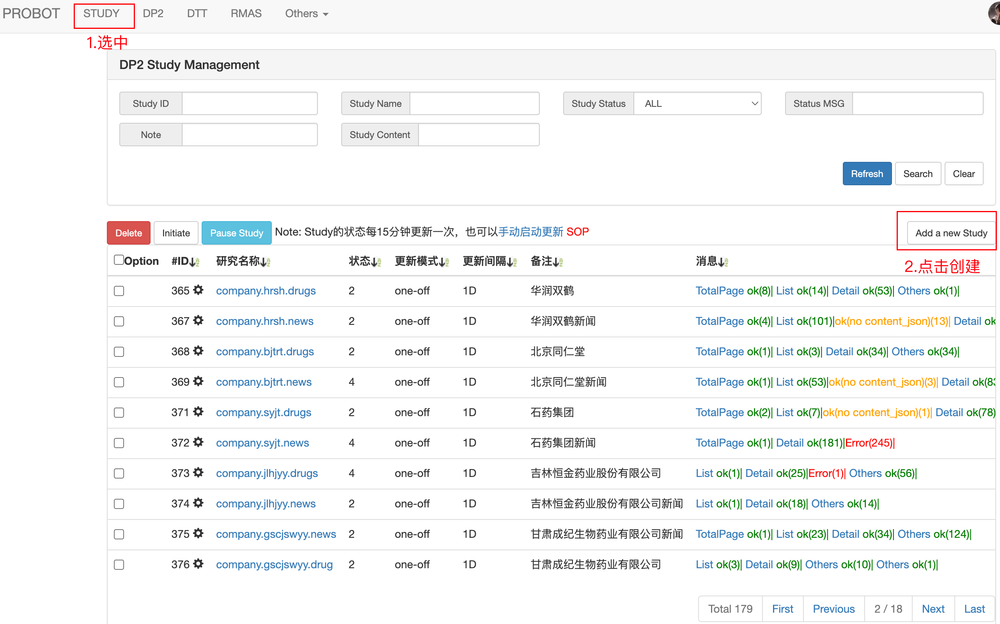
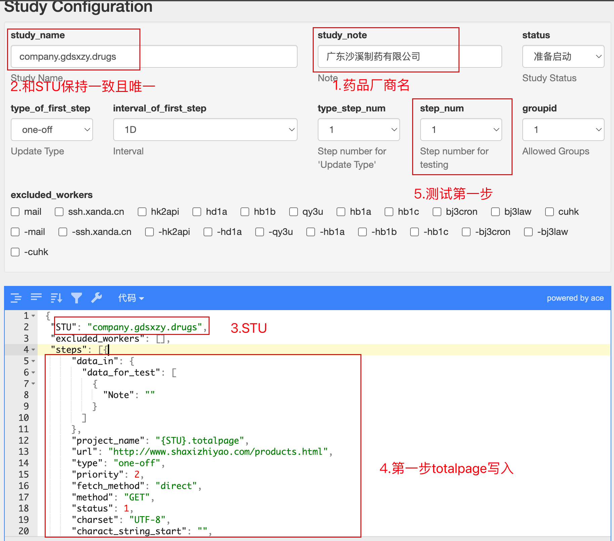
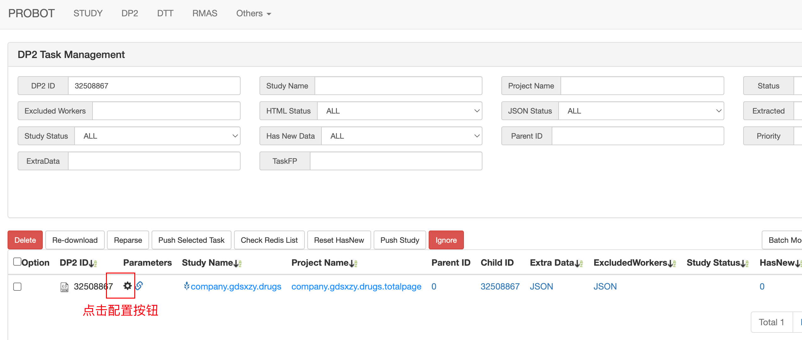
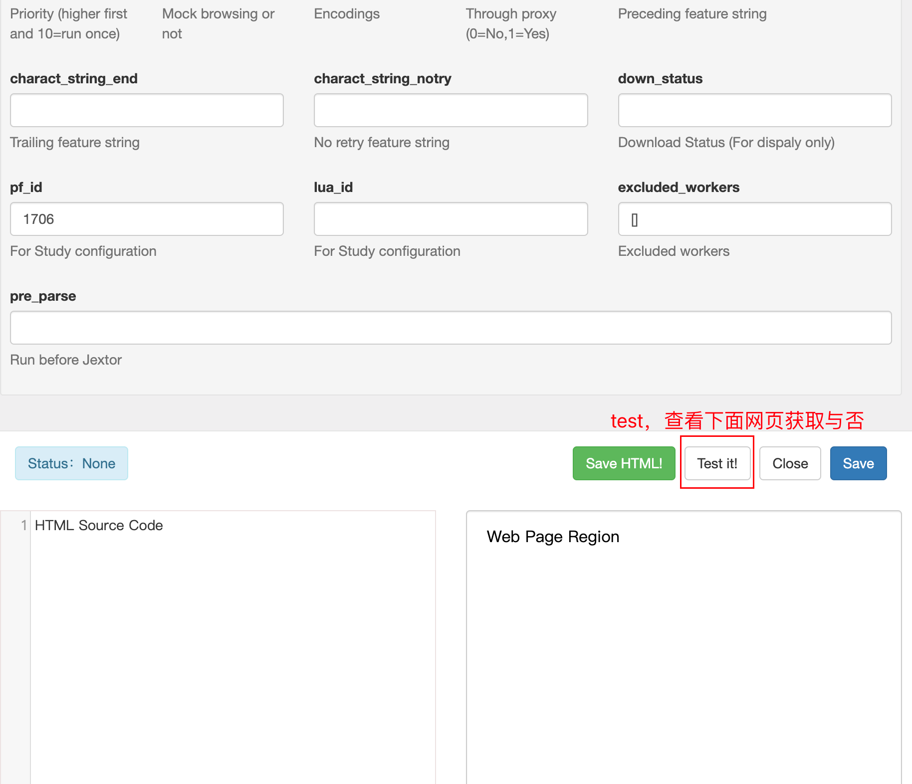
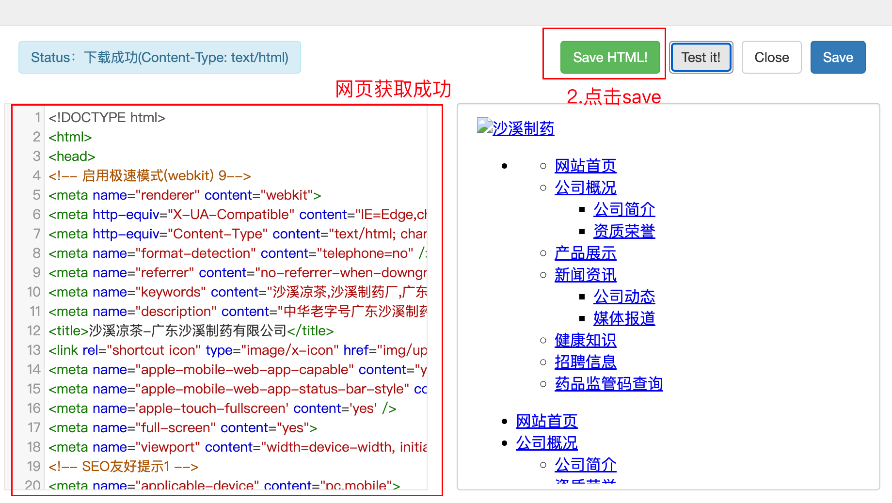
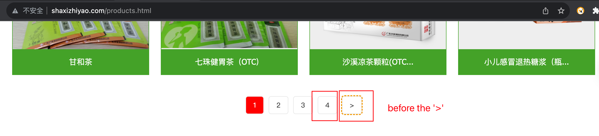
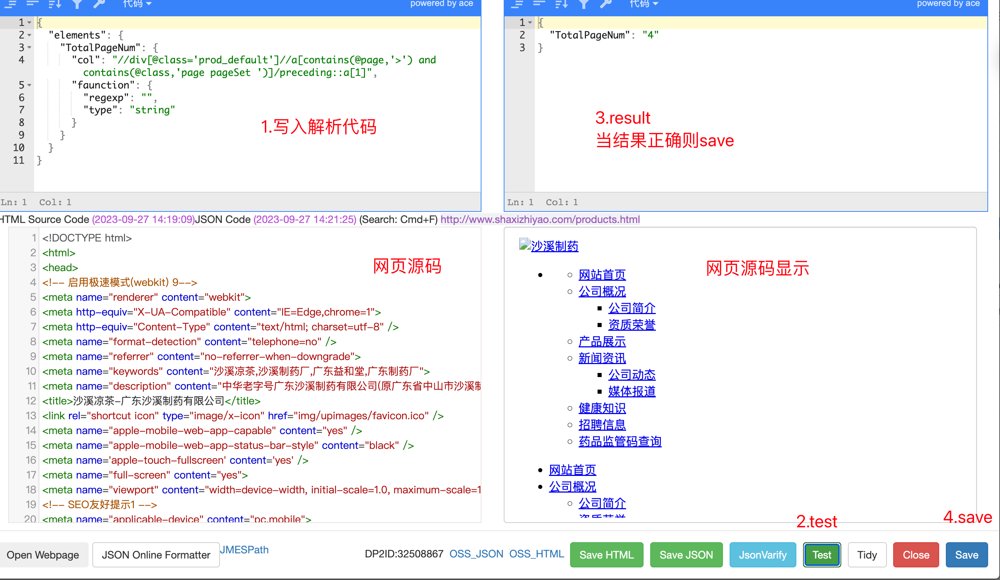
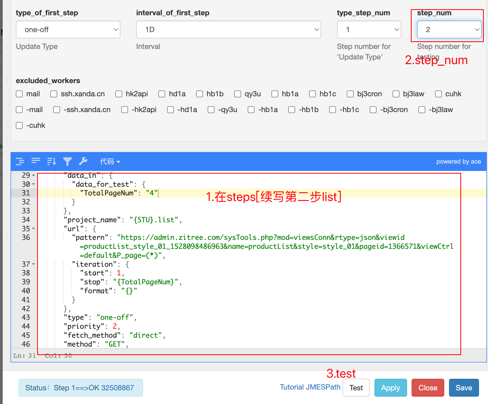

# 项目示例

## company.<name\>.drugs

[进入dp平台](http://dp2.labqr.com/e/dp2/study)

示例:[广东沙溪制药有限公司](http://www.shaxizhiyao.com/aboutus.html)

参考study编号：443

### 创建study



### 确定step流程

根据网站产品页面情况选择不同的step流程

`totalpage-list-detail-attachment`

根据[study.company](some_templete/study.company_drug&news.md)模版选择内容

#### totalpage_step 

`"url"` 选择产品页面

```json
{
      "data_in": {
        "data_for_test": [
          {
            "Note": ""
          }
        ]
      },
      "project_name": "{STU}.totalpage",
      "url": "http://www.shaxizhiyao.com/products.html",
      "type": "one-off",
      "priority": 2,
      "fetch_method": "direct",
      "method": "GET",
      "status": 1,
      "charset": "UTF-8",
      "charact_string_start": "",
      "charact_string_end": "",
      "pf_id": 1502,
      "data_out": [
        {
          "jpath": ""
        }
      ],
      "interval": "86400",
      "excluded_workers": "{excluded_workers}"
    }
```



进入step1默认生成的task_id


跳转到如下页面







Close弹窗之后点击如下按钮，进入jexter的界面




根据上面网页找到总页码然后再jexter的界面写入代码，如下图步骤所示



#### List_step

根据页码跳转分析得到如下信息:

```
"url":"https://admin.zitree.com/sysTools.php?mod=viewsConn&rtype=json&viewid=productList_style_01_1528098486963&name=productList&style=style_01&pageid=1366571&viewCtrl=default&P_page=4"

```

```json
 {
      "data_in": {
        "data_for_test": {
          "TotalPageNum": "4",
        }
      },
      "project_name": "{STU}.list",
      "url": {
        "pattern": "https://admin.zitree.com/sysTools.php?mod=viewsConn&rtype=json&viewid=productList_style_01_1528098486963&name=productList&style=style_01&pageid=1366571&viewCtrl=default&P_page=(*)",
        "iteration": {
          "start": 1,
          "stop": "{TotalPageNum}",
          "format": "{}"
        }
      },
      "type": "one-off",
      "priority": 2,
      "fetch_method": "direct",
      "method": "GET",
   		"cookies": {
        "headers": {
          "content_type": "application/json",
          "Referer": "http://www.shaxizhiyao.com/products.html"
        }
      },
      "status": 1,
      "charset": "UTF-8",
      "charact_string_start": "",
      "charact_string_end": "",
      "pf_id": 1503,
      "data_out": {
        "jpath": ""
      },
      "interval": "86400",
      "excluded_workers": "{excluded_workers}"
    },
```

此时测试页码1~4，将上面代码加入steps[]中


获取网页之后进入Jexter界面输入以下代码：

```json
{
  "elements": {
    "link": {
      "col": "//div[@data-key='html']",
      "function": {
        "regexp": "(.+)",
        "type": "string",
        "html_extractor": {
          "total_rows":"//div[@class='p_name titleSet pc']",
          "elements": {
            "link": {
              "col": "./a/@href",
              "type": "string",
              "prefix":"http://www.shaxizhiyao.com/"
            }
          }
        }
      }
    }
  },
   "data_out":{"jq":".link"}
}
```

 一般先用`"callback": "absolute_url"` 此处无效则使用前缀字符

结果如下

```json
[
  {
    "link": "http://www.shaxizhiyao.com/pro_details_5238527.html"
  },
  {
    "link": "http://www.shaxizhiyao.com/pro_details_1653595.html"
  }
]
```

#### detial_step

```json
    {
      "data_in": {
        "data_for_test": [
          {
            "link": "http://www.shaxizhiyao.com/pro_details_5238527.html"
          },
          {
            "link": "http://www.shaxizhiyao.com/pro_details_1653595.html"
          }
        ]
      },
      "project_name": "{STU}.detail",
      "url": "{link}",
      "type": "one-off",
      "priority": 2,
      "fetch_method": "direct",
      "method": "GET",
      "status": 1,
      "charset": "UTF-8",
      "charact_string_start": "",
      "charact_string_end": "",
      "add_only": 1,
      "excluded_workers": "{excluded_workers}",
      "interval": 5184000,
      "data_out": {
        "jpath": "",
        "api": {
          "url": "http://api2.drugsea.cn/dp2/mongo/save",
          "table": "china_manufacture_products",
          "where": {
            "uniqueId": "{dp2_id}"
          },
          "data": {
            "dp2_id": "{dp2_id}",
            "drug_name": "{drug_name}",
            "company": "{company}",
            "attachments": "{attachments}",
            "auth_num": "{auth_num}",
            "drug_reference": "{drug_reference}"
          }
        }
      },
      "pf_id": 1708
    },
```

Jexter

```json
{
  "elements": {
    "dp2_id": "TASK_id",
    "company": {
      "text": "广东沙溪制药有限公司"
    },
    "drug_name": "//div[@class='collage_main prodName_01 titProSet']",
    "drug_reference": {
      "innerHtml": "//div[@names='customDetail']"
    },
    "auth_num":{"col":"//div[@class='prodetail prodetail_1_cd pcAbout detailContent']//span[contains(text(),'批准文号')]/..",
      "function":{
        "regexp":"国药.+",
        "return":0,
        "type":"string"
      }
    },
    "attachments": {
      "col": "//span[@class='img_0']/@urlsrc",
      "data_out":{"jq":"[{link:.}]"}
      }
    }
    }
```

Jexter_result

```json
{
  "dp2_id": 32510406,
  "company": "广东沙溪制药有限公司",
  "drug_name": "槐角丸",
  "drug_reference": "<div>...",
  "auth_num": "国药准字Z44020504",
  "attachments": [
    {
      "link": "https://cdn.yun.sooce.cn/4/35009/png/1662363437851e0d0947a2640be98.png?version=0"
    }
  ]
}
```

#### attachment_step

```json
{
      "data_in": {
        "jpath": "attachments",
        "data_for_test": {
          "attachments": [
            {
              "link": "https://cdn.yun.sooce.cn/4/35009/png/1662363437851e0d0947a2640be98.png?version=0"
            }
          ]
        }
      },
      "project_name": "{STU}.attachments",
      "url": "{link}",
      "type": "one-off",
      "priority": 2,
      "fetch_method": "direct",
      "method": "GET",
      "status": 1,
      "charset": "UTF-8",
      "charact_string_start": "",
      "charact_string_end": "",
      "add_only": 1,
      "excluded_workers": "{excluded_workers}",
      "interval": 5184000,
      "pf_id": 1702,
      "data_out": {
        "jpath": "{key:key}",
        "api": {
          "url": "http://api2.drugsea.cn/dp2/mongo/save/v2",
          "table": "china_manufacture_products",
          "where": {
            "uniqueId": "{dp2_id}"
          },
          "data": {
            "data.attachments.{row_idx}.key": "{key}"
          }
        }
      }
    }
```

mongodb result


```json
{
    "_id" : ObjectId("651545611ac6f17ee34eb389"),
    "project_name" : "china_manufacture_products",
    "uniqueId" : "32510845",
    "data" : {
        "dp2_id" : "32510845",
        "drug_name" : "养血生发胶囊",
        "company" : "广东沙溪制药有限公司",
        "attachments" : [
            {
                "link" : "https://cdn.yun.sooce.cn/4/35009/png/164983299436832952648292b92fd.png?version=0",
                "key" : "dp2_attachments/443af0058c5461ac5519813065e5c353"
            }
        ],
        "auth_num" : "国药准字Z44020231",
        "drug_reference" : "...",
        "row_idx" : NumberInt(1)
    },
    "row_idx" : NumberInt(0)
}
```


## company.<name\>.news

### 创建study

和drug类似

### 确定step流程

根据网站产品页面情况选择不同的step流程

`totalpage-list-detail-attachment`

根据[study.company](some_templete/study.company_drug&news.md)模版选择内容

新闻totalpage

```
http://www.shaxizhiyao.com/news.html#newsList_style_02_1543919099984
```

新闻list

```
https://admin.zitree.com/sysTools.php?mod=viewsConn&rtype=json&idweb=35009&viewid=newsList_style_02_1543919099984&name=newsList&style=style_02&langid=0&pageid=1366559&viewCtrl=newsList&newsShow[]=pic&newsShow[]=date&newsShow[]=title&newsShow[]=summary&newsShow[]=page&newsShow[]=article&sort=id&newsnum=8&column=1&titlenum=40&newpicwidth=250&newPicScale=3:4&detailnum=[object%20Object]&newsGids[]=185587&newsGids[]=185589&showtarget=_blank&showat=1366565&News_page=(*)
```

新闻Detial

```
http://www.shaxizhiyao.com/news_details_3355899.html
```

新闻Attachments

```
https://cdn.yun.sooce.cn/4/35009/jpg/163029176252228e583ceb41f95ac.jpg?version=1630291764
```


#### Study_step

```json
{
  "STU": "company.gdsxzy.news",
  "excluded_workers": [],
  "steps": [
   	 {
      "data_in": {
        "data_for_test": [
          {
            "Note": ""
          }
        ]
      },
      "project_name": "{STU}.totalpage",
      "url": "http://www.shaxizhiyao.com/news.html#newsList_style_02_1543919099984",
      "type": "one-off",
      "priority": 2,
      "fetch_method": "direct",
      "method": "GET",
      "status": 1,
      "charset": "UTF-8",
      "charact_string_start": "",
      "charact_string_end": "",
      "pf_id": 1502,
      "data_out": [
        {
          "jpath": ""
        }
      ],
      "interval": "86400",
      "excluded_workers": "{excluded_workers}"
    },
     {
      "data_in": {
        "data_for_test": {
          "TotalPageNum": "2",
          "linKey": "ji-tuan-dong-tai-list"
        }
      },
      "project_name": "{STU}.list",
      "url": {
        "pattern": "https://admin.zitree.com/sysTools.php?mod=viewsConn&rtype=json&idweb=35009&viewid=newsList_style_02_1543919099984&name=newsList&style=style_02&langid=0&pageid=1366559&viewCtrl=newsList&newsShow[]=pic&newsShow[]=date&newsShow[]=title&newsShow[]=summary&newsShow[]=page&newsShow[]=article&sort=id&newsnum=8&column=1&titlenum=40&newpicwidth=250&newPicScale=3:4&detailnum=[object%20Object]&newsGids[]=185587&newsGids[]=185589&showtarget=_blank&showat=1366565&News_page=(*)",
        "iteration": {
          "start": 1,
          "stop": "{TotalPageNum}",
          "format": "{}"
        }
      },
      "type": "one-off",
      "priority": 2,
      "fetch_method": "direct",
      "method": "GET",
      "status": 1,
      "cookies": {
        "headers": {
          "content_type": "application/json",
          "Referer": "http://www.shaxizhiyao.com/products.html"
        }
      },
      "charset": "UTF-8",
      "charact_string_start": "",
      "charact_string_end": "",
      "pf_id": 1503,
      "data_out": {
        "jpath": ""
      },
      "interval": "86400",
      "excluded_workers": "{excluded_workers}"
    },
    {
      "data_in": {
        "data_for_test": [
          {
            "link": "http://www.shaxizhiyao.com/news_details_3355899.html"
          }
        ]
      },
      "project_name": "{STU}.detail",
      "url": "{link}",
      "type": "one-off",
      "priority": 2,
      "fetch_method": "direct",
      "method": "GET",
      "status": 1,
      "charset": "UTF-8",
      "charact_string_start": "",
      "charact_string_end": "",
      "add_only": 1,
      "excluded_workers": "{excluded_workers}",
      "interval": 5184000,
      "data_out": {
        "jpath": "",
        "api": {
          "url": "http://api2.drugsea.cn/dp2/mongo/save",
          "table": "china_manufacture_products",
          "where": {
            "uniqueId": "{dp2_id}"
          },
          "data": {
            "dp2_id": "{dp2_id}",
            "drug_name": "{drug_name}",
            "company": "{company}",
            "attachments": "{attachments}",
            "drug_reference": "{drug_reference}"
          }
        }
      },
      "pf_id": 1684
    },
     {
      "data_in": {
        "jpath": "attachments",
        "data_for_test": {
          "attachments": [
            {
              "link": ":link:https://cdn.yun.sooce.cn/4/35009/jpg/163029176252228e583ceb41f95ac.jpg?version=1630291764"
            }
          ]
        }
      },
      "project_name": "{STU}.attachments",
      "url": "{link}",
      "type": "one-off",
      "priority": 2,
      "fetch_method": "direct",
      "method": "GET",
      "status": 1,
      "charset": "UTF-8",
      "charact_string_start": "",
      "charact_string_end": "",
      "add_only": 1,
      "excluded_workers": "{excluded_workers}",
      "interval": 5184000,
      "pf_id": 1702,
      "data_out": {
        "jpath": "{key:key}",
        "api": {
          "url": "http://api2.drugsea.cn/dp2/mongo/save/v2",
          "table": "china_manufacture_products",
          "where": {
            "uniqueId": "{dp2_id}"
          },
          "data": {
            "data.attachments.{row_idx}.key": "{key}"
          }
        }
      }
    }
  ]
	}
```

#### Jexter

##### Totalpage_step

```json
{
  "elements": {
    "TotalPageNum": {
      "col": "//div[@class='boxNewsListStyle_10']//a[contains(@page,'···')]/preceding::a[1]"
    }
  }
}
```

##### List_step

对于此网址的study步骤需新增cookies字段,才能获得网页内容。

```json
{
  "elements": {
    "link": {
      "col": "//div[@data-key='html']",
      "function": {
        "regexp": "(.+)",
        "type": "string",
        "html_extractor": {
          "total_rows":"//div[@class='show_all']//a[@class='btnaSet' and contains(text(),'查看全文')]",
          "elements": {
            "link": {
              "col": "./@href",
              "type": "string",
              "prefix":"http://www.shaxizhiyao.com/"
            }
          }
        }
      }
    }
  },
   "data_out":{"jq":".link"}
}
```

result

```json
[
  {
    "link": "https://mp.weixin.qq.com/s?__biz=MzA4ODYzOTQyMA==&mid=2647547133&idx=3&sn=da220726a082ab64aec18450d55ad04c&chksm=881dee2ebf6a6738b5f7122cbf55793b20e989a4171dc42decbae7c181af6917d3509191cb3e&token=358298251&lang=zh_CN#rd"
  },
  {
    "link": "https://mp.weixin.qq.com/s?__biz=MzA4ODYzOTQyMA==&mid=2647547133&idx=1&sn=9ca3e71a93115bd9f58808ed01160982&chksm=881dee2ebf6a6738548a2e5f3cdbd8bd76d15cb386a5cf021d3a2a52c568458ccef2d2b4e7f1&token=358298251&lang=zh_CN#rd"
  },
  {
    "link": "https://mp.weixin.qq.com/s?__biz=MzA4ODYzOTQyMA==&mid=2647547090&idx=1&sn=1a37ead7080fe405a76e3b2bbf4ddf71&chksm=881dee01bf6a6717f319ce10a27ffa57686ee6e652c564627fd7cd9efef7e06f0832941ccc21&token=358298251&lang=zh_CN#rd"
  },
  {
    "link": "https://mp.weixin.qq.com/s?__biz=MzA4ODYzOTQyMA==&mid=2647547090&idx=2&sn=bb9b8f6df56ce1ad0c1f32061643be6b&chksm=881dee01bf6a6717182ad7231045d101d1cd89b4114ec4a51a3098571c0fde38ca4f51ad9efd&token=358298251&lang=zh_CN#rd"
  },
  {
    "link": "https://mp.weixin.qq.com/s?__biz=MzA4ODYzOTQyMA==&mid=2647547058&idx=1&sn=20a811e3460d42529d1dbad3ee9d876a&chksm=881dee61bf6a67778a430a01bf37ff9b4918f2b634b176c01e56ac60c1e17f39753af755a1a0&token=358298251&lang=zh_CN#rd"
  },
  {
    "link": "https://mp.weixin.qq.com/s?__biz=MzA4ODYzOTQyMA==&mid=2647547032&idx=1&sn=fb359a2179845042097e57bbdeeefc4b&chksm=881dee4bbf6a675d8979726cd80c2cc1aa36e2a9bbe45e615a6302bba4df32c560a22d7ccabd&token=358298251&lang=zh_CN#rd"
  },
  {
    "link": "https://mp.weixin.qq.com/s?__biz=MzA4ODYzOTQyMA==&mid=2647547020&idx=1&sn=89bc639d7bda55c9b4792d2ed1b85d7d&chksm=881dee5fbf6a674973e7066fdfe23ff73e0e63bc394b5ed020855c920cb4fc8f97933f7b128f&token=358298251&lang=zh_CN#rd"
  },
  {
    "link": "https://mp.weixin.qq.com/s?__biz=MzA4ODYzOTQyMA==&mid=2647547020&idx=2&sn=6b13985b0932105f74036d049a5aed17&chksm=881dee5fbf6a674967c676adf41880301b45d693651cc91ce99ebbe53dd3afbb3e1e316a8239&token=358298251&lang=zh_CN#rd"
  }
]
```

##### detail

```json
{
  "elements": {
    "title": "//h1[@class='newsBigTit titleSet']",
    "date": {
      "col": "//font[contains(@class,'songti xinxi newsInfoSet')]",
      "callback": "extract_date"
    },
    "attachments": {
      "innerHtml": "//div[@class='detailContentView']",
      "extract_attachments": {}
    },
    "content": {
      "innerHtml": "//div[@class='detailContentView']"
    }
  }
}
```

result

```json
{
  "title": "总有一种绕指柔，百炼为刚更风流",
  "date": "2021-08-30",
  "attachments": [
    {
      "task_fp": "060eeb6e7fbcbedc0de53591ae58e933",
      "dp2_id": 32510548,
      "title": "163029176252228e583ceb41f95ac.jpg?version=1630291764",
      "link": "https://cdn.yun.sooce.cn/4/35009/jpg/163029176252228e583ceb41f95ac.jpg?version=1630291764",
      "type": ""
    },
    {
      "task_fp": "060eeb6e7fbcbedc0de53591ae58e933",
      "dp2_id": 32510548,
      "title": "163029182349977173f2aeb008af3.jpg?version=1630291825",
      "link": "https://cdn.yun.sooce.cn/4/35009/jpg/163029182349977173f2aeb008af3.jpg?version=1630291825",
      "type": ""
    },
    {
      "task_fp": "060eeb6e7fbcbedc0de53591ae58e933",
      "dp2_id": 32510548,
      "title": "16302918307111e9643a597a9dac9.jpg?version=1630291832",
      "link": "https://cdn.yun.sooce.cn/4/35009/jpg/16302918307111e9643a597a9dac9.jpg?version=1630291832",
      "type": ""
    },
    {
      "task_fp": "060eeb6e7fbcbedc0de53591ae58e933",
      "dp2_id": 32510548,
      "title": "16302919592547fe44b4e789b13db.jpg?version=1630291960",
      "link": "https://cdn.yun.sooce.cn/4/35009/jpg/16302919592547fe44b4e789b13db.jpg?version=1630291960",
      "type": ""
    },
    {
      "task_fp": "060eeb6e7fbcbedc0de53591ae58e933",
      "dp2_id": 32510548,
      "title": "1630291955109a1a12ef5c9beca2e.jpg?version=1630291957",
      "link": "https://cdn.yun.sooce.cn/4/35009/jpg/1630291955109a1a12ef5c9beca2e.jpg?version=1630291957",
      "type": ""
    },
    {
      "task_fp": "060eeb6e7fbcbedc0de53591ae58e933",
      "dp2_id": 32510548,
      "title": "16302919551124e927ccad107f3b0.jpg?version=1630291957",
      "link": "https://cdn.yun.sooce.cn/4/35009/jpg/16302919551124e927ccad107f3b0.jpg?version=1630291957",
      "type": ""
    },
    {
      "task_fp": "060eeb6e7fbcbedc0de53591ae58e933",
      "dp2_id": 32510548,
      "title": "1630291955111cafa4c4e0f1a0294.jpg?version=1630291957",
      "link": "https://cdn.yun.sooce.cn/4/35009/jpg/1630291955111cafa4c4e0f1a0294.jpg?version=1630291957",
      "type": ""
    }
  ],
  "content": "..."
}
```

所有test完成正确则保存study并initial它。

